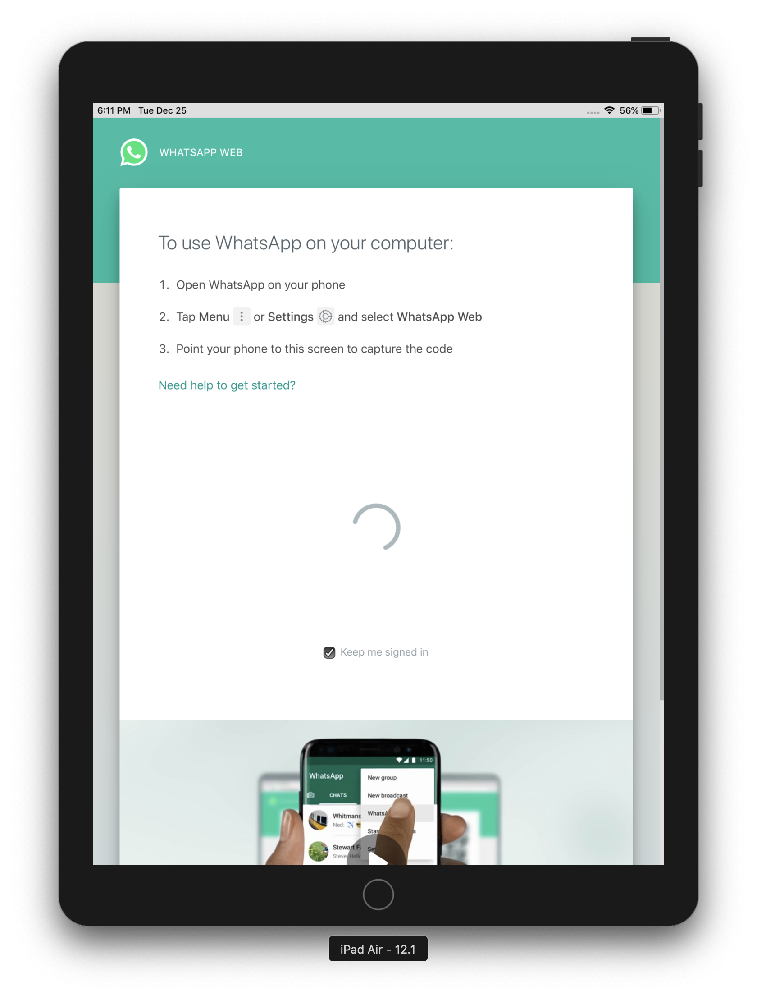

# Whosapp

Disclaimer: This is in no way associated with Whatsapp or Facebook.

## Motivation

My Mother wanted to use Whatsapp on her iPad and if you go to `web.whatsapp.com`, you'll get redirected to the landing page of Whatsapp Web. You can hold the Refresh button and then tap `Request Desktop Site` which will bring you to the Desktop version of Whatsapp Web. Unfortunately, this won't be remembered on future visits.

The user experience around having to constantly tap `Request Desktop Site` is not ideal. I took a look at the iPad apps that do something similar and they are problematic. They are full of ads or introduce predatory tactics to get you to pay a hefty subscription fee.

This project is meant to be an ad-free and safer alternative to those apps in the App Store.

## Usage

This app is targeting iOS devices on 12.1 and up.
You'll also need Xcode 10 to install and run the app on a device (assuming you have registered as an Apple Developer).

## Screenshots

This app is essentially a webview that opens `web.whatsapp.com` but uses a Desktop user agent to _trick_ the website into thinking the User is on a Desktop instead of an iPad.

## Limitations

This has the same limitations as using Whatsapp on a browser does.
The offline experience could use some more love as it currently just displays some plain HTML telling the user to relaunch the application and check their connection.

However, for most use cases this should be good enough. Enjoy!
